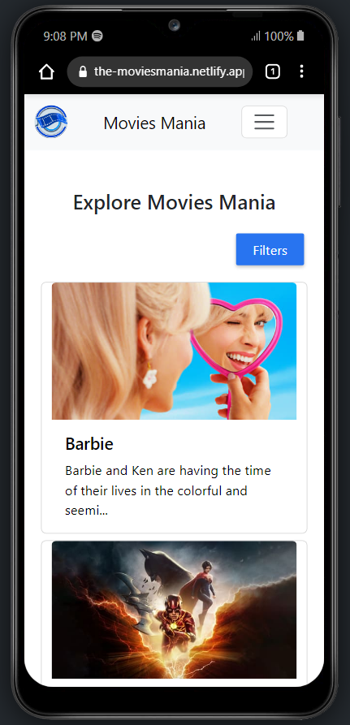

# The MoviesMania - Movie Review Website

The MoviesMania is a movie website that offers a vast collection of movie reviews and information about various films. It allows users to explore the latest movie releases, read reviews, and discover essential details about their favorite movies. The website utilizes the TMDb (The Movie Database) API to fetch movie data and provide a seamless user experience.

## Website URL

[https://the-moviesmania.netlify.app/](https://the-moviesmania.netlify.app/)

## Key Features

- **Movie Reviews:** Get access to authentic and comprehensive movie reviews from both users and critics. Make informed decisions about which movies to watch based on others' experiences and ratings.

- **TMDb Integration:** The website leverages the power of the TMDb API to pull data related to movies, including movie details, cast and crew, ratings, trailers, and more.

- **Search Functionality:** Easily search for specific movies using the search bar. Retrieve detailed information about movies you are interested in and access their respective reviews.

- **Curated Recommendations:** Discover specially curated movie recommendations based on genres, popular movies, and trending films.

## Installation and Setup

1. Clone this repository to your local machine using `git clone`.
2. Navigate to the project directory and install the required dependencies with `npm install`.
3. Obtain your API key from TMDb (https://www.themoviedb.org/) and replace the placeholder in the code with your key.
4. Run the development server using `npm start` and access the website locally at `http://localhost:3000`.

## Technology Stack

- Front-end: HTML, CSS, JavaScript (React)
- Back-end: Node.js (Express.js)
- Data Source: TMDb API

## Contributing

We welcome contributions to enhance The MoviesMania and make it even better. Feel free to raise issues, submit pull requests, and suggest new features.

